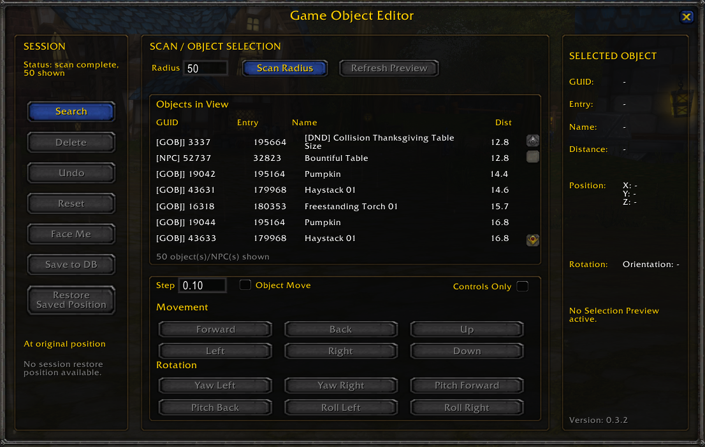
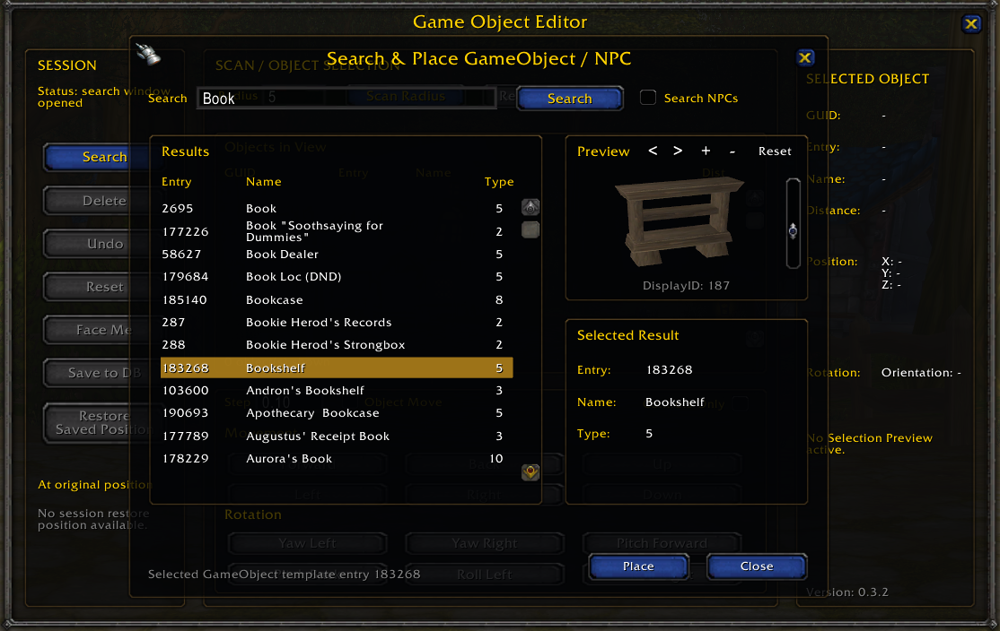
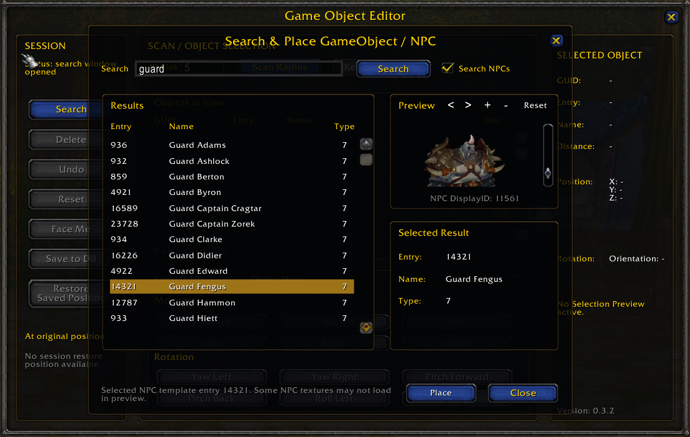
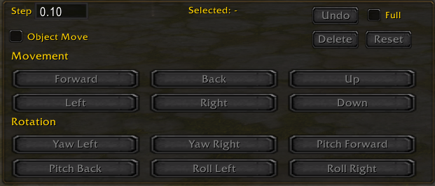

<p align="center">
  
</p>

# 🛠️ GObject Editor Tool

**GObject Editor Tool** is an AzerothCore world-editing toolkit built for faster in-game building, object placement, NPC placement, and scene editing.

It combines a **server-side AzerothCore module** with an **in-game WoW addon UI**, giving builders a cleaner way to manage **GObjects and NPCs** without relying only on typed commands.

Made by **Grimoire**.

## 🎥 Showcase Video

Watch the GObject Editor Tool showcase on YouTube:

[▶️ Watch on YouTube](https://youtu.be/X_A0Bfu7_X4)

---

## ✨ Features

* 🧱 GObject placement and editing workflow
* 🧍 NPC placement and editing workflow
* 🎮 In-game UI addon controls
* 🧭 Movement controls for precise positioning
* 🔁 Rotation controls
* 📐 Adjustment controls for cleaner object setup
* 🔎 Search window for finding entries
* 🪟 Popout controls window
* ↩️ Undo support
* 🧰 Builder-focused layout
* 📘 Included PDF user guide
* 🧩 Server module + client addon package

---

## 📦 Repository Structure

```
GObject-Editor-Tool/
├── mod-gobject-editor/          ← Server module (C++ source + CMake)
│   ├── CMakeLists.txt
│   ├── conf/
│   │   └── mod_gobject_editor.conf.dist
│   └── src/
│       └── GObjectEditor.cpp
├── GObjectEditorUI/             ← WoW client addon
│   ├── GObjectEditorUI.lua
│   └── GObjectEditorUI.toc
├── assets/                      ← Screenshots
├── Docs/                        ← Changelogs
├── GObjectEditorUI_User_Guide_V0.3.4.pdf
└── README.md
```

---

## ✅ Requirements

* AzerothCore WotLK 3.3.5a server
* WoW 3.3.5a client
* CMake ≥ 3.16
* C++20 compiler (MSVC 19.24+ or GCC/Clang with C++20)
* Access to your AzerothCore `modules` folder

---

## 🧩 Server Module Installation

### 1. Clone into modules

```bash
cd azerothcore-wotlk/modules/
git clone https://github.com/blaaahhhh187/GObject-Editor-Tool.git
```

The module folder `mod-gobject-editor/` inside the repo is auto-detected by AzerothCore's CMake.

### 2. Reconfigure & Rebuild

```bash
cd azerothcore-wotlk/
mkdir -p build && cd build
cmake .. -DMODULES=static
cmake --build . --config RelWithDebInfo
```

The module requires **no SQL files** — it uses existing DB tables.

### 3. Configuration (optional)

After first CMake run, a config file `mod_gobject_editor.conf` is created from the `.dist` template. Key options:

| Option | Default | Description |
|---|---|---|
| `GObjectEditor.Enable` | 1 | Enable/disable the module |
| `GObjectEditor.RequiredSecurity` | 3 | Required GM level (3 = admin) |
| `GObjectEditor.MaxScanDistance` | 50.0 | Max scan range in yards |
| `GObjectEditor.MaxNudgeDistance` | 5.0 | Max move step per nudge |
| `GObjectEditor.Debug` | 0 | Debug logging (0 = off) |

---

## 🎮 Addon Installation

### 1. Copy the Addon Folder

Copy `GObjectEditorUI/` from this repository into your WoW client:

```
World of Warcraft/Interface/AddOns/GObjectEditorUI/
```

### 2. Enable the Addon

Launch the game → **AddOns** at character select → enable **GObject Editor Tool**.

---

## 🚀 Basic Usage

Once the module and addon are installed, open the GObject Editor Tool in game.

<p align="center">
  
</p>

The tool is designed to help with:

* 🧱 GObject placement
* 🧱 GObject movement
* 🧱 GObject rotation
* 🧍 NPC placement
* 🧍 NPC movement
* 🧍 NPC rotation
* 🔎 Searching for entries
* ↩️ Undoing recent placement/editing actions
* 🪟 Using a popout control window while building

The goal is to make object and NPC editing faster, cleaner, and easier to manage from an in-game UI.

---

## 🔎 Search Window

The search button opens a dedicated search window.

Use the search field to look for entries and narrow down what you want to work with.

The search window supports both GObject searching and NPC searching.

### 🧱 GObject Search

Use the normal search mode to find and preview GObject entries before placing them in game.

<p align="center">
  
</p>

### 🧍 NPC Search

Enable **Search NPCs** to search and preview NPC entries before placing them in game.

<p align="center">
  
</p>

The search window is intended to keep the main tool clean while still giving access to entry lookup functionality.

---

## 🪟 Popout Controls Window

The popout controls window provides a separate control panel for editing actions.

<p align="center">
  
</p>

This helps keep controls accessible while working outside the main editor interface.


---

## 📘 User Guide

A PDF user guide is included:

```text
GObjectEditorUI_User_Guide_V0.3.4.pdf
```

Use the PDF for a more visual walkthrough of the tool and basic usage.

---

## 📁 Repository Layout

```
GObject-Editor-Tool/
├── mod-gobject-editor/          ← Server module (cloned into AC modules/)
│   ├── CMakeLists.txt
│   ├── conf/mod_gobject_editor.conf.dist
│   └── src/GObjectEditor.cpp
├── GObjectEditorUI/             ← WoW client addon
├── assets/                      ← Screenshots
├── Docs/changelogs/             ← Version history
├── releases/                    ← Archived ZIP releases
├── GObjectEditorUI_User_Guide_V0.3.4.pdf
└── README.md
```

---

## 🛠️ Install Locations

```
mod-gobject-editor/  →  azerothcore-wotlk/modules/mod-gobject-editor/  (via git clone)
GObjectEditorUI/     →  WoW/Interface/AddOns/GObjectEditorUI/           (copy)
```

---

## 🧰 Troubleshooting

### CMake does not detect the module

The repo must be cloned **inside** `azerothcore-wotlk/modules/`, not elsewhere. CMake scans subdirectories of `modules/` automatically and detects `mod-gobject-editor/CMakeLists.txt`.

### Addon does not show in game

Check that the addon folder is installed here:

```
World of Warcraft/Interface/AddOns/GObjectEditorUI/
```

Make sure the `.toc` file is directly inside `GObjectEditorUI/` (not nested).

Wrong:
```
Interface/AddOns/GObjectEditorUI/GObjectEditorUI/GObjectEditorUI.toc
```

Correct:
```
Interface/AddOns/GObjectEditorUI/GObjectEditorUI.toc
```

### Server does not recognize the module

Ensure the module was built into worldserver — check CMake output for `mod-gobject-editor`. If missing, re-clone into `modules/` and re-run CMake.

### UI opens but functions do not work

Make sure **both** parts are installed:
- Server module (`mod-gobject-editor` built into worldserver)
- Client addon (`GObjectEditorUI` in AddOns folder)

The addon UI requires the server-side module for full functionality.

---

## ⚠️ Notes

* This tool is made for AzerothCore WotLK 3.3.5a.
* This is a builder/world-editing tool.
* Server-side access is required.
* Rebuilding the server is required after installing the module.
* The addon alone is not the full tool.
* No SQL files needed — the module uses existing DB tables.

---

## 📜 License

This project uses the **GNU General Public License v3.0**.

---

## 👤 Credits

Created by **Grimoire**. Fork maintained by **blaaahhhh187** with compatibility fixes.

---

## 🏷️ Version

V0.3.4 — fixed for current AzerothCore (CMake modern API, CreatureData::id compatibility, HandleSelect security fix)

