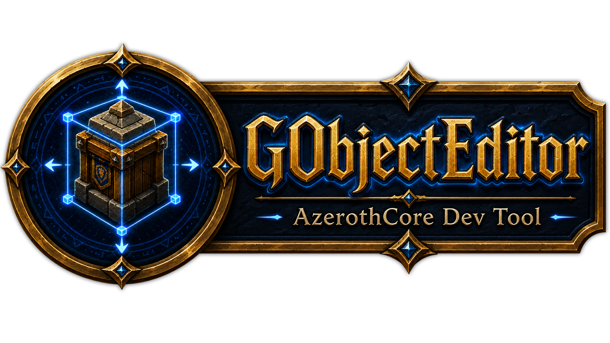

<p align="center">
  
</p>

# 🛠️ GObject Editor Tool

**GObject Editor Tool** is an AzerothCore world-editing toolkit built for faster in-game building, object placement, NPC placement, and scene editing.

It combines a **server-side AzerothCore module** with an **in-game WoW addon UI**, giving builders a cleaner way to manage **GObjects and NPCs** without relying only on typed commands.

Made by **Grimoire**.

---

## ✨ Features

* 🧱 GObject placement and editing workflow
* 🧍 NPC placement and editing workflow
* 🎮 In-game UI addon controls
* 🧭 Movement controls for precise positioning
* 🔁 Rotation controls
* 📐 Adjustment controls for cleaner object setup
* 🔎 Search window for finding entries
* 🪟 Popout controls window
* ↩️ Undo support
* 🧰 Builder-focused layout
* 📘 Included PDF user guide
* 🧩 Server module + client addon package

---

## 📦 Included Files

This GitHub repository includes:

```text
README.md
GObject_Editor_Tool_User_Guide.pdf
GObject_Editor_Tool.zip
```

The ZIP contains the install package:

```text
GObject_Editor_Tool/
├─ module/
│  └─ GObjectEditor/
│     └─ server module files
│
└─ addon/
   └─ GObjectEditor/
      └─ WoW addon files
```

---

## ✅ Requirements

* AzerothCore WotLK 3.3.5a server
* WoW 3.3.5a client
* Access to your AzerothCore `modules` folder
* Ability to rebuild your AzerothCore server
* Ability to install WoW addons into the client

The addon and module are designed to work together.
The addon provides the UI, while the module provides the server-side support.

---

## 🧩 Server Module Installation

### 1. Download and Extract

Download:

```text
GObject_Editor_Tool.zip
```

Extract the ZIP.

Open:

```text
GObject_Editor_Tool/module/
```

---

### 2. Copy the Module Folder

Copy the included module folder into your AzerothCore modules directory.

Example:

```text
azerothcore-wotlk/modules/GObjectEditor/
```

Your final path should look like:

```text
azerothcore-wotlk/
└─ modules/
   └─ GObjectEditor/
      └─ module files
```

Use the actual included module folder name.

---

### 3. Reconfigure AzerothCore

After placing the module inside the `modules` folder, rerun CMake for your AzerothCore build.

Use your normal AzerothCore CMake workflow:

```text
Configure
Generate
```

---

### 4. Rebuild the Server

Rebuild your AzerothCore server.

At minimum, rebuild:

```text
worldserver
```

A full rebuild is also fine if that is your normal workflow.

---

### 5. Apply SQL Files If Included

If the module includes SQL files, apply them to the correct AzerothCore database.

Check the file name and folder path before applying SQL.

Common AzerothCore databases include:

```text
acore_world
acore_auth
acore_characters
```

Do not apply SQL blindly.
Use the database target indicated by the SQL file or folder location.

---

### 6. Start the Server

Start your server normally.

Watch the `worldserver` console for startup errors.

If the server starts cleanly, the module side is installed.

---

## 🎮 Addon Installation

### 1. Open the Addon Folder

From the extracted ZIP, open:

```text
GObject_Editor_Tool/addon/
```

---

### 2. Copy the Addon Folder

Copy:

```text
GObjectEditor
```

into your WoW client AddOns folder:

```text
World of Warcraft/Interface/AddOns/
```

Final path:

```text
World of Warcraft/Interface/AddOns/GObjectEditor/
```

---

### 3. Enable the Addon

Launch the game.

At the character select screen:

1. Click **AddOns**
2. Find **GObject Editor Tool**
3. Enable it
4. Enter the game

---

## 🚀 Basic Usage

Once the module and addon are installed, open the GObject Editor Tool in game.

The tool is designed to help with:

* 🧱 GObject placement
* 🧱 GObject movement
* 🧱 GObject rotation
* 🧍 NPC placement
* 🧍 NPC movement
* 🧍 NPC rotation
* 🔎 Searching for entries
* ↩️ Undoing recent placement/editing actions
* 🪟 Using a popout control window while building

The goal is to make object and NPC editing faster, cleaner, and easier to manage from an in-game UI.

---

## 🔎 Search Window

The search button opens a dedicated search window.

Use the search field to look for entries and narrow down what you want to work with.

The search window is intended to keep the main tool clean while still giving access to entry lookup functionality.

---

## 🪟 Popout Controls Window

The popout controls window provides a separate control panel for editing actions.

This helps keep controls accessible while working with the main editor interface.

The popout window is designed to appear clearly in front of the main window and should not use transparency.

---

## 📘 User Guide

A PDF user guide is included:

```text
GObject_Editor_Tool_User_Guide.pdf
```

Use the PDF for a more visual walkthrough of the tool and basic usage.

---

## 📁 Recommended GitHub Layout

This repository should contain:

```text
README.md
GObject_Editor_Tool_User_Guide.pdf
GObject_Editor_Tool.zip
```

The README stays outside the ZIP so GitHub can display it on the repository front page.

The PDF stays outside the ZIP so users can open it directly.

The ZIP contains the install package for the module and addon.

---

## 🛠️ Package Layout

Inside the ZIP:

```text
GObject_Editor_Tool/
├─ module/
│  └─ GObjectEditor/
│     └─ server module files
│
└─ addon/
   └─ GObjectEditor/
      └─ WoW addon files
```

Install locations:

```text
module/GObjectEditor  →  AzerothCore/modules/
addon/GObjectEditor   →  World of Warcraft/Interface/AddOns/
```

---

## 🧰 Troubleshooting

### Addon does not show in game

Check that the addon folder is installed here:

```text
World of Warcraft/Interface/AddOns/GObjectEditor/
```

Make sure the `.toc` file is directly inside the `GObjectEditor` folder.

Wrong:

```text
Interface/AddOns/GObjectEditor/GObjectEditor/GObjectEditor.toc
```

Correct:

```text
Interface/AddOns/GObjectEditor/GObjectEditor.toc
```

---

### Server does not recognize the module

Check that the module folder is inside:

```text
azerothcore-wotlk/modules/
```

Then rerun CMake and rebuild the server.

---

### SQL errors on startup

Check whether the module included SQL files.

Make sure each SQL file was applied to the correct database.

Do not apply world SQL to auth or character databases.

---

### UI opens but functions do not work

Make sure both parts are installed:

```text
Server module
Client addon
```

The addon UI requires the server-side module support for full functionality.

---

## ⚠️ Notes

* This tool is made for AzerothCore WotLK 3.3.5a.
* This is a builder/world-editing tool.
* Server-side access is required.
* Rebuilding the server is required after installing the module.
* The addon alone is not the full tool.
* The module and addon should be kept together as matching versions.

---

## 📜 License

This project uses the **GNU General Public License v3.0**.

---

## 👤 Credits

Created by **Grimoire**.

Built for AzerothCore worldbuilding, GObject editing, NPC placement workflows, and cleaner in-game building tools.

---

## 🏷️ Version

```text
V#
```

Replace `V#` with the current release version before publishing.
